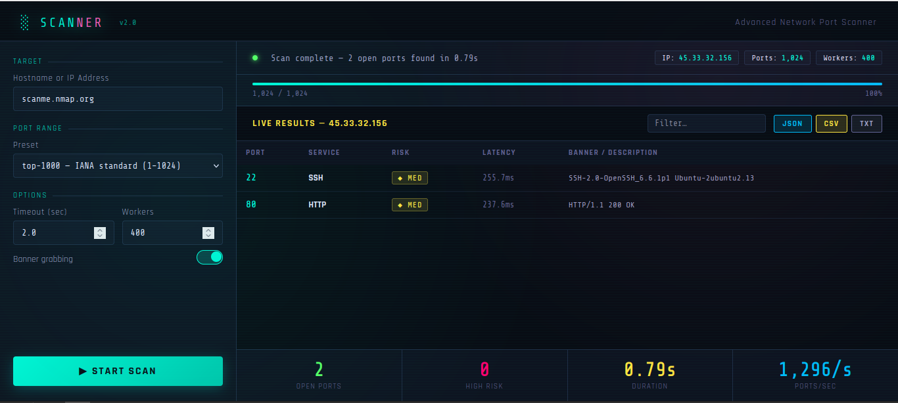

# 🔍 Port Scanner

> Advanced network port scanner with a sleek web GUI and full-featured CLI — zero external dependencies, pure Python stdlib.



---

## ✨ Features

### GUI (`portscanner_gui.py`)
- 🌐 Browser-based interface — opens automatically at `http://localhost:7331`
- ⚡ Real-time live results streamed as ports are discovered
- 📊 Animated progress bar with ETA and scan rate
- 🎨 Color-coded risk levels — `▲ HIGH` / `◆ MED` / `● LOW`
- 🔍 Live filter box to search by port, service, or banner
- 💾 One-click export — JSON, CSV, or TXT

### CLI (`portscanner.py`)
- 🖥️ Interactive TUI mode with guided prompts
- 🚀 Multi-threaded scanning — up to 600+ concurrent workers
- 🏷️ Service banner grabbing (HTTP, SSH, FTP, and more)
- 📋 80+ port-to-service mappings with risk classification
- 💾 Export results to JSON, CSV, or TXT

### Both versions
- 🔒 Risk classification based on known exposure levels
- ⏱️ Per-port latency measurement
- 🔄 Reverse DNS lookup
- 🧩 6 preset port ranges + custom port spec support
- 📦 **Zero dependencies** — Python 3.8+ stdlib only

---

## 🚀 Quick Start

```bash
# Clone the repo
git clone https://github.com/Navin-2003/cyber-security.git
cd cyber-security/port-scanner

# Launch the GUI (recommended)
python3 portscanner_gui.py
```

Browser opens automatically at **http://localhost:7331**

---

## 🖥️ CLI Usage

```bash
# Interactive mode
python3 portscanner.py

# Quick scan with preset
python3 portscanner.py scanme.nmap.org --preset web

# Custom ports
python3 portscanner.py 192.168.1.1 --ports 22,80,443,8000-9000

# Full options
python3 portscanner.py 10.0.0.1 --preset full --timeout 0.5 --workers 500 --export json
```

### CLI Flags

| Flag | Default | Description |
|------|---------|-------------|
| `--preset` | `top-100` | Port range preset |
| `--ports` | — | Custom port spec e.g. `22,80,1000-2000` |
| `--timeout` | `1.0` | Seconds per connection |
| `--workers` | `300` | Concurrent threads |
| `--no-banners` | off | Disable banner grabbing |
| `--export` | — | Export format: `json`, `csv`, `txt` |

---

## 📦 Port Presets

| Preset | Ports | Description |
|--------|-------|-------------|
| `top-100` | ~80 | Known services + major databases |
| `top-1000` | 1024 | IANA standard port space |
| `web` | 12 | HTTP/HTTPS + dev servers |
| `database` | 12 | SQL, NoSQL, caches |
| `infra` | 15 | SSH, DNS, SNMP, LDAP, NFS |
| `full` | 65535 | All TCP ports (slow) |

---

## 🧪 Safe Testing Targets

| Target | Notes |
|--------|-------|
| `scanme.nmap.org` | Official Nmap test server — publicly permitted |
| `localhost` | Your own machine |
| `127.0.0.1` | Same as above |
| Your LAN IP | Your router / local network |

> ⚠️ **Only scan systems you own or have explicit permission to test.**  
> Unauthorized port scanning may violate laws including the CFAA and equivalent legislation in your country.

---

## 📁 Project Structure

```
port-scanner/
├── portscanner.py        # CLI version — terminal TUI
├── portscanner_gui.py    # GUI version — browser interface
├── requirements.txt      # No dependencies (stdlib only)
├── README.md
└── img/
    └── portscan.png      # GUI screenshot
```

---

## ⚙️ Requirements

- Python **3.8+**
- No pip installs needed — uses stdlib only (`socket`, `threading`, `http.server`, `json`, `csv`)

---

## 📄 License

MIT — free to use, modify, and distribute.

---

<p align="center">
  Part of the <a href="https://github.com/Navin-2003/cyber-security">🛡️ Navin-2003 / cyber-security toolkit</a>
</p>
